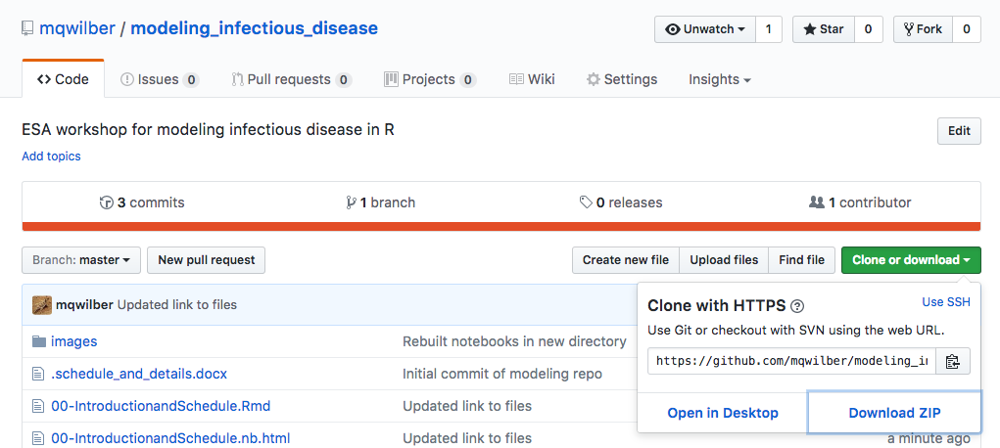

Welcome to the *Modeling Infectious Disease Dynamics in R* workshop at ESA 2017. 

**Instructors**: Cherie Briggs and Mark Wilber

**Where are we from?**: Department of Ecology, Evolution, and Marine Biology at University of California, Santa Barbara

# Goals

1. Conceptualize and write down systems of dynamical equations describing epidemiological systems
2. Simulate and analyze these systems of equations
3. Parameterize the dynamical, epidemiological models from data 

# Schedule

| **Topic** | **Time**  |
|-----------|-----------|
| Introduction | 8:00 - 8:15 |
| Simulating discrete-time disease models | 8:15 - 9:15 |
| Coffee Break | 9:15 - 9:30 |
| Analyzing continuous-time disease models | 9:30 - 10:30 |
| Coffee Break | 10:30 - 10:40 |
| Fitting dynamic models to data | 10:40 - 11:30 |

## Getting started

- To download the lessons and materials for this workshop, go to [https://github.com/mqwilber/modeling_infectious_disease](https://github.com/mqwilber/modeling_infectious_disease), click the green "Clone or download"" button and click "Download as ZIP"

---

- Unzip the downloaded folder `modeling_infectious_disease-master` and place it on your Desktop.
- Open up a blank R script in R studio.  You will be actively typing code into this script as we go through the workshop.
- **Stickie notes**: You will have a red and green stickie note at your table.  Put up a red stickie note if you get stuck on something and one of us (Cherie or Mark) will come help you.  Put up a green stickie note when you have finished an exercise and are ready to move on.

