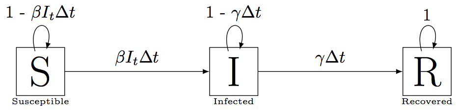

*Portions of this lesson were adopted from Software Carpentry*

**Learning Goals**

1. Understand how to write down discrete-time formulations of disease models
2. Learn how to write functions and for loops in R to simulate discrete-time disease models
3. Learn how Euler's Method can be used to transition between discrete-time models and continuous-time models

---

## A discrete-time SIR

Let's start by considering a simple discrete time Susceptible-Infected-Recovered (SIR) model with a fixed host population size.

In this model we have three state variables: 

1. $S_t$: Density of susceptible hosts
2. $I_t$: Density of infected hosts
3. $R_t$: Density of resistant hosts

The model looks like this



where the parameters are defined as

- $\beta$: Transmission parameter (units = infecteds$^{-1}$time$^{-1}$)
- $\gamma$: Recovery rate (units = time$^{-1}$)

and

- $\beta I_t \Delta t$ is the probability of a susceptible becoming infected over $\Delta t$ (density-dependent transmission)
- $\gamma \Delta t$ is the probability of an infected individual recovering over $\Delta t$

We can write this as a system of discrete-time update equations.

$$
\begin{align}
S_{t + \Delta t} &= S_t(1 - \beta I_t \Delta t) \\
I_{t + \Delta t} &= \beta I_t S_t \Delta t  + I_t (1 - \gamma \Delta t) \\
R_{t + \Delta t} &= R_t + \gamma I_t \Delta t
\end{align}
$$

---

**There are a few questions we might want to ask with this model**

1. What is the threshold susceptible density below which the pathogen can't invade?
2. What is the peak outbreak size and at what time does this peak occur?

To answer these questions, we could either

a. Solve the system analytically
b. Explore the system via simulation

This SIR model is easy to solve analytically, but that is not true for all disease models.  Today we are going to learn how to answer questions like these by **simulating the model.**

## Simulating a discrete-time SIR model in R

To simulate this SIR model in any programming language, we need to do the following things

1. Specify values for the parameters $\beta$ and $\gamma$ and the initial conditions for $S_0$, $I_0$,and $R_0$.
2. Choose a time step $\Delta t$.
2. With these values and initial conditions, update $S_0$, $I_0$, and $R_0$ at $t = 0$ to $S_1$, $I_1$, and $R_1$ at $t = 1$.
3. Repeat this a large number of times.

There are two computing concepts that we will need to do this:  **for loops** and **functions**.  But before we get into that, try the following exercise.

> ### Exercise 1: Assigning initial conditions
>
> Define R variables named `S0`, `I0`, `R0`, `beta`, `gamma`, and `deltat` and assign them values such that $S_0 = 99$, $I_0 = 1$, $R_0 = 0$, $\beta = 0.1$, $\gamma = 1$, and $\Delta t = 0.001$.

```{r}
# HIDE ME IF YOU DON'T WANT TO SEE THE ANSWER

S0 = 99 # Initial number of susceptibles
I0 = 1 # Initial number of infecteds
R0 = 0 # Initial number of recovered
beta = 0.1 # per infecteds per week
gamma = 1 # per week
deltat = 0.001 # weeks
```


### Updating the state variables a single time step

Now that we have defined our initial conditions, let's update our state variables a single time step and assign this update to a new variable. To update $S_0$ one time step, we can use the following R code and the equation $S_{t + \Delta t} = S_t(1 - \beta I_t \Delta t)$

```{r}
S1 = S0*(1 - beta*I0*deltat)
print(S1)
```

> ### Exercise 2: Writing update equations
>
> Write the equivalent update equations for $I_1$ and $R_1$. For reference, the equations are

$$
\begin{align}
S_{t + \Delta t} &= S_t(1 - \beta I_t \Delta t) \\
I_{t + \Delta t} &= \beta I_t S_t \Delta t  + I_t (1 - \gamma \Delta t) \\
R_{t + \Delta t} &= R_t + \gamma I_t \Delta t
\end{align}
$$


```{r}
# HIDE ME IF YOU DON'T WANT TO SEE THE ANSWER

I1 = I0*(1 - gamma*deltat) + beta*I0*S0*deltat
R1 = R0 + gamma*I0*deltat
print(c(I1, R1))
```


> Once you have done that, calculate $S_2$, $I_2$, and $R_2$ using the update equations.

```{r}
# HIDE ME IF YOU DON'T WANT TO SEE THE ANSWER

S2 = S1*(1 - beta*I1*deltat)
I2 = I1*(1 - gamma*deltat) + beta*I1*S1*deltat
R2 = R1 + gamma*I1*deltat

print(c(S2, I2, R2))
```

---

If you are anything like me, you probably copy and pasted your code to calculate $S_2$, $I_2$, and $R_2$. While there is nothing *technically* wrong with that, copying code can propogate mistakes throughout your models and makes it hard to debug your models when something is going wrong. One way to solve this problem is to use **functions**.

**Point to remember**: Any time you find yourself reusing the same code, make it into a function!

---

## Functions in R

If you have any experience using R, you have already used many, many built in functions. For example, `mean` is a built in R function that let's you compute the mean of an array of numbers

```{r}
mean(1:8)
```

`sum` is also a built in function.

```{r}
sum(c(4, 5, 2, 3))
```

Notice that to call a function in R we type the name of the function (e.g. `sum`) and two parentheses (`sum()`).  Inside these parentheses, we give the function an **argument**. For example, the vector `c(4, 5, 2, 3)` is the argument we give to the function `sum`.

If you think about it, this is just like when you learned about mathematical functions. For example, take the equation

$$f(x_1, x_2, x_3) = x_1 + x_2 + x_3$$

$f$ is a function that takes three arguments $(x_1, x_2, x_3)$ and then computes their sum. The exact same concept applies for functions when programming.

### Defining a Function 

**For more details click [here](http://swcarpentry.github.io/r-novice-inflammation/02-func-R/)**

One really powerful thing about programming languages (like R), is that they allow you to define your own functions. This is something that is incredibly useful when doing any kind of dynamic modeling.

Let’s get some practice by defining a function `fahr_to_kelvin` that converts temperatures from Fahrenheit to Kelvin:

```{r}
fahr_to_kelvin <- function(temp) {
  # Convert Far. to Kelvin
  
  kelvin <- ((temp - 32) * (5 / 9)) + 273.15
  return(kelvin)
}
```

1. We define `fahr_to_kelvin` by assigning it to the output of `function`. 
2. The list of argument names are contained within parentheses. In this case there is one argument, `temp`, but there could be as many as you want, if you chose to define your function that way (i.e. `fahr_to_kelvin(temp1, temp2, temp3)`) 
3. Next, the body of the function – the statements that are executed when it runs – is contained within curly braces (`{}`). The statements in the body are indented by two spaces, which makes the code easier to read but does not affect how the code operates.
When we call the function, the arguments we pass to it are assigned to those variables so that we can use them inside the function. 
4. Inside the function, we use a [return statement](http://swcarpentry.github.io/r-novice-inflammation/reference/#return-statement) to send a result back to whoever asked for it.

Using our own function is no different from using any other R function:

```{r}
# Freezing point of water
fahr_to_kelvin(32)
```

```{r}
# Boiling point of water
fahr_to_kelvin(212)
```

Notice inside the `fahr_to_kelvin` function there is a variable called `kelvin`.  What if I did the following  

```{r}
fahr_to_kelvin(212)
kelvin
```

What happened?  `kelvin` is only defined *within the scope* of the function.  In otherwords, when the function `fahr_to_kelvin` is called it creates a temporary variable named `kelvin` and then deletes it once it is finished. So the global environment of R does not know what `kelvin` is.  Similarly, there is no variable named `temp` in the global environment.  R only knows about it inside the function. Check out [this](http://swcarpentry.github.io/r-novice-inflammation/14-supp-call-stack/) excellent tutorial for more information.

> ### Exercise 3: Turn your update equations into a function
>
> Write a function called `update_SIR` that takes in six arguments ($S_t$, $I_t$, $R_t$, $\beta$, $\gamma$, and $\Delta t$) and returns the values 
> $S_{t + \Delta t}$, $I_{t + \Delta t}$, $R_{t + \Delta t}$.  
>
> **Hint**: Have the return statement of the function look something like `return(c(S=Stplus1, I=Itplus1, R=Rtplus1))`. This returns a vector where the items in the vector are names S, I, and R.

```{r}
# HIDE ME IF YOU DON'T WANT TO SEE THE ANSWER

update_SIR <- function(St, It, Rt, beta, gamma, deltat){
  # Update equations for SIR function
  
  # Update values
  Stplus1 = St - beta*It*St*deltat
  Itplus1 = It + beta*It*St*deltat - gamma*It*deltat
  Rtplus1 = Rt + gamma*It*deltat
  
  # Return
  return(c(S=Stplus1, I=Itplus1, R=Rtplus1))
  
}
```

Test your function gives the following output

```{r}
update_SIR(S0, I0, R0, beta, gamma, deltat)
```

---

Now that we have defined our function, we can use it to sequentially to simulate our SIR model

```{r}

# Update one time step
step1 = update_SIR(S0, I0, R0, beta, gamma, deltat)
print(step1)

# Update another time step
step2 = update_SIR(step1["S"], step1["I"], step1["R"], beta, gamma, deltat)
print(step2)
```

Great! But what if we wanted to update 1,000 or 10,000 time steps?  Typing this out would be impossible.  Fortunately, we have a computer and it is really, really good at doing repetitive tasks. **For loops** are one way we can make computers repeat themselves and are an incredibly useful concept when doing any type of scientific computing.

## For loops in R 

**For more information click [here](http://swcarpentry.github.io/r-novice-inflammation/03-loops-R/)**

If you haven't seen it before, the syntax for a **for loop** can be a little strange. Here is the general syntax

```{r, eval=F}
# Note this for loop won't run, it is just for demonstration purposes
for(object in container){

  # DO SOMETHING

}

```

Let's break this down.  `container` is an entity in R that contains some number of objects.  For example, `container` might be an array of words

```{r}
container = c("Disease", "ecology", "rules!")
print(container)
```

In this case, `container` holds three words (objects): "Disease", "ecology", and "rules". 

```{r}
length(container)
```

What if I wanted to R to print each of these objects sequentially?  I could do something like

```{r}
print(container[1])
print(container[2])
print(container[3])
```

This is, of course, repetitive.  I could use a for loop where the "DO SOMETHING" part is printing a word

```{r}
for(object in container){
  print(object)
}
```

R sequentially took each word in the variable `container`, assigned it to the variable `object` and printed it to the screen.

Note that `container` can be any variable that has multiple objects and `object` is an arbitrary name for the objects with the container. 

The following example illustrates this

```{r}
my_cool_sentence = c("Disease", "ecology", "rules!")

for(word in my_cool_sentence){
  print(word)
}
```

I have replaced `container` with `my_cool_sentence` and `object` with `word`. It works exactly the same as before.

One other useful thing is that for loops let you loop over indexes. Above, when I manually printed about the words in `container` I did it using the syntax `container[i]`, where `i` is the index 1, 2, or 3. I can take advantage of this syntax in a for loop.

```{r}

# my_cool_sentence has 3 items.
num_items = length(my_cool_sentence)

# Loop over the vector c(1, 2, 3) and print the ith word in the vector
for(i in 1:num_items){
  print(my_cool_sentence[i])
}

```


> ### Exercise 4: Write a for loop to compute a sum
>
> Take the vector of numbers `nums = c(1, 3, 4, 6, 3, 1)`.  You could easily compute the sum of these numbers by typing `sum(nums)`. Try writing your own function called `my_sum` that
> takes in a vector of numbers as an argument, uses a for loop to add the numbers together, and returns the sum of the numbers.
>
> **Hint**: Try defining a variable called `tot` and start by setting `tot = 0`. Increment `tot` on each iteration of the for loop.

```{r}
# HIDE ME IF YOU DON'T WANT TO SEE THE ANSWER

my_sum = function(nums){
  
  tot = 0 
  for(number in nums){
    tot = tot + number
  }
  
  return(tot)
}

# Compare my_sum function with R's default sum function
nums = c(1, 3, 4, 6, 3, 1)
print(my_sum(nums))
print(sum(nums))
```

## Using for loops to simulate the SIR model through time

We want to use the for loop to update our SIR model a large number of times so we can explore the predicted disease dynamics.

Let's work through the following steps in order to do this

1. Redefine our initial values
2. Specify how many time steps we want to run the model for (i.e. how many iterations we need in the for loop)
3. Create a matrix for saving the results after each time step

```{r}
S0 = 99 # Initial number of susceptibles
I0 = 1 # Initial number of infecteds
R0 = 0 # Initial number of recovered
beta = 0.1 # Transmission parameter
gamma = 1 # Recovery rate
deltat = 0.001 # weeks

TIME = 5 # weeks
STEPS = TIME / deltat # Total number of steps

# Make array to hold results
sim_results = array(NA, dim=c(STEPS + 1, 3))
sim_results[1, ] = c(S0, I0, R0)

# Naming columns for easy identification
colnames(sim_results) = c("S", "I","R")
```

`sim_results` is an array that has `STEPS + 1` rows and 3 columns and will be used to hold the results of the simulation.

```{r}

# Arrays can be indexed using the following bracket notation
sim_results[1, ] # first row all columns
sim_results[2, ] # second row all columns
sim_results[1, 1] # first row and first column
```

Now let's write the for loop and use the `update_SIR` function to simulate our SIR model

```{r}
# Run the model for STEPS iterations
for(step_num in 1:STEPS){
  
  # Extract current S, I, R values
  St = sim_results[step_num, "S"]
  It = sim_results[step_num, "I"]
  Rt = sim_results[step_num, "R"]
  
  # Update the SIR values one time step
  res = update_SIR(St, It, Rt, beta, gamma, deltat)
  
  # Save the updated SIR values
  sim_results[step_num + 1, ] = res
}
```

Let's look at our results. `head` is a useful function for only looking at the top-most portion of an array or data.frame in R.

```{r}
head(sim_results)

# Equivalently we could type sim_results[1:6, ]
```

Our resulting array has 3 columns holding our state variables - S, I, and R - which are updated every `deltat = 0.001` time steps.  I can access, for example, the susceptible trajectory by typing `sim_results[, "S"]` or `sim_results[, 1]`. This will give me a vector with 5001 entries

Now that we have run the model for 5000 time steps, let's plot the trajectories

```{r}
# Get time on the week scale
weeks = 1:(STEPS + 1) * deltat 

plot(weeks, sim_results[, "S"], type="l", col="red", xlab="Weeks", ylab="Host density", ylim=c(0, S0 + 1))
lines(weeks, sim_results[, "I"], type="l", col="blue")
lines(weeks, sim_results[, "R"], type="l", col="black")
legend(4, S0, legend=c("S", "I", "R"), fill=c("red", "blue", "black"))
```


> ### Exercise 5: Exploring the SIR dynamics
>
> $R_0$ is an important epidemilogical statistic that describes the average number of secondary infections produced over the lifetime of an average infected individual. When $R_0 > 1$ an epidemic can occur (i.e. pathogen can successfully invade a fully susceptible host population).  In this model, we can analytically calculate $R_0$ as $R_0 = \frac{S_0 \beta}{\gamma}$.  Play around with model above to answer the following questions. 
>
> 1. Given the default values of $\beta = 0.1$ and $\gamma = 1$, what is (approximately) the minimum susceptible density ($S_0$) such that density of infected hosts (blue line on the plot) initially increases before decreasing? In other words, this is the $S_0$ density at which $R_0 \approx 1$. Does this value match with threshold density of $S_0$ that you could compute from the analytical solution of $R_0$ given above?  Hint: It might be helpful to set `ylim=c(0, 2)` on your plot to visualize this.
>
> 2. Using $S_0 = 99$, $I_0 = 1$, $\beta = 0.1$ and $\gamma = 1$, what is the peak size of the epidemic in terms of density of infecteds? At what time point does this occur? Hint: Explore the functions `max` and `which.max`.  
>
> 3. Using $S_0 = 99$, $I_0 = 1$, $\beta = 0.1$ and $\gamma = 1$, explore what happens to the model dynamics when you increase `deltat` from 0.001, 0.01, 0.1, to 1.


```{r}
# HIDE ME IF YOU DON'T WANT TO SEE THE ANSWERS

# Answer to Part 2

# What is the peak size of the epidemic?
max(sim_results[, "I"])

# What time does this occur?
# which.max is a function that returns the index at which a vector has its maximum. By selecting that
# index in the `weeks` vector, we get the time (in weeks) at which the epidemic reached its maximum.
max_index = which.max(sim_results[, "I"])
weeks[max_index]
```

## Euler's Method for simulating continuous-time ODEs

Let's take a look at our discrete update equations for the SIR model. 

$$
\begin{align}
S_{t + \Delta t} &= S_t(1 - \beta I_t \Delta t) \\
I_{t + \Delta t} &= \beta I_t S_t \Delta t  + I_t (1 - \gamma \Delta t) \\
R_{t + \Delta t} &= R_t + \gamma I_t \Delta t
\end{align}
$$

I can do a bit of rearranging and rewrite them as

$$
\begin{align}
S_{t + \Delta t} &= S_t - \beta I_t S_t \Delta t \\
I_{t + \Delta t} &= I_t + \beta I_t S_t \Delta t  - \gamma I_t \Delta t \\
R_{t + \Delta t} &= R_t + \gamma I_t \Delta t
\end{align}
$$

Some further rearranging gives

$$
\begin{align}
\frac{S_{t + \Delta t} - S_t}{\Delta t}  &= -\beta I_t S_t \\
\frac{I_{t + \Delta t} - I_t}{\Delta t} &= \beta I_t S_t  - \gamma I_t \\
\frac{R_{t + \Delta t} - R_t}{\Delta t} &= \gamma I_t
\end{align}
$$

Now taking the limit $\Delta t \rightarrow 0$ we get

$$
\begin{align}
\frac{d S}{dt}  &= -\beta I S \\
\frac{d I}{dt} &= \beta I S  - \gamma I \\
\frac{d R}{dt} &= \gamma I
\end{align}
$$

This is a set of of Ordinary Differential Equations (ODEs) that describes our SIR model (Cherie will talk about these in depth in the next section). What we have just done in this lesson is use **Euler's Method** to approximate a set of ODEs with discrete update equations. 

Notice that the above math tells us that the discrete update equations for the SIR model and the ODEs are equivalent when $\Delta t \rightarrow 0$. Conversely, this implies that the approximate equivalency breaks down when $\Delta t$ is large. This explains why, in exercise 5, the dynamics of the discrete SIR model changed as $\Delta t$ increased above 0.01. 

In general, Euler's Method is a very intuitive way to simulate ODEs and is theoretically applicable to any system of ODEs given a small enough step size. However, it often does a poor job approximating the ODE when $\Delta t$ is large relative to how fast the system is changing. In some cases the system is changing fast enough that $\Delta t$ would have to be intractably small to accurately capture the dynamics.

In the next section you will see that R has built in methods to simulate ODEs that largely obviates the need to think about the appropriate step size for you model. However, thinking in terms of Euler's Method is a useful way to see the link between discrete-time and continuous-time formulations of disease models.

