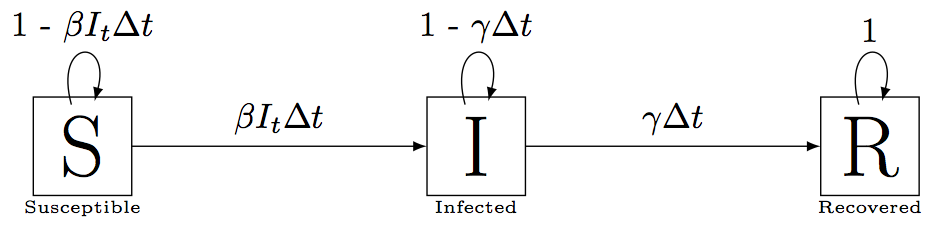

*Portions of this lesson were adopted from Software Carpentry*

**Learning Goals**

1. Understand how to write down discrete-time formulations of disease models
2. Learn how Euler's Method can be used to simulate continuous-time disease models
3. Review how to write functions in R 

---

## A discrete-time SIR

Let's start by considering a simple discrete time Susceptible-Infected-Recovered (SIR) model with a fixed host population size.

In this model we have three state variables: 

1. $S_t$: Density of susceptible hosts
2. $I_t$: Density of infected hosts
3. $R_t$: Density of resistant hosts

The model looks like this



where the parameters are defined as

- $\beta$: Transmission parameter (units = infecteds$^{-1}$time$^{-1}$)
- $\gamma$: Recovery rate (units = time$^{-1}$)

and

- $\beta I_t \Delta t$ is the probability of a susceptible becoming infected over $\Delta t$
- $\gamma \Delta t$ is the probability of an infected individual recovering over $\Delta t$

Notice that we are assuming that the probability of a susceptible becoming infected is $\beta I_t \Delta t$.  This is known as **density-dependent transmission**.  Conceptually, this transmission function is making the assumption that the average number of contacts that a host makes over $\Delta t$ is proportional to the density of hosts. Another commonly made assumption is that the average number of contacts a host makes is fixed over $\Delta t$.  This is known as **frequency-dependent transmission** and the probability of infection over $\Delta t$ takes the form $\beta \frac{I_t}{N}\Delta t$.

Another commonly used term that we will be referring to is the **the force of infection**.  The **force of infection** is a rate (units = time$^{-1}$) and is defined as the per capita rate at which susceptible hosts become infected. Under density-dependent transmission, the force of infection is $\beta I_t$ (time$^{-1}$) and under frequency-dependent transmission the force of infection is $\beta \frac{I_t}{N}$ (time$^{-1}$). Multiplying by $\Delta t$ yields a unit-less probability.

What else are we assuming in this simple SIR model?

1. Host population size is fixed and there are no host births and deaths
2. There is no disease-induced mortality
3. Hosts are immediately infectious (i.e. there is no latent period)
4. What other assumptions do you notice?

### Turning our diagram into update equations

We can write the SIR model defines above as a series of update equations

$$
\begin{align}
S_{t + \Delta t} &= S_t(1 - \beta I_t \Delta t) \\
I_{t + \Delta t} &= \beta I_t S_t \Delta t  + I_t (1 - \gamma \Delta t) \\
R_{t + \Delta t} &= R_t + \gamma I_t \Delta t
\end{align}
$$

---

**There are a few questions we might want to ask with this model**

1. What is the threshold susceptible density below which the pathogen can't invade?
2. What is the peak outbreak size and at what time does this peak occur?

To answer these questions, we could either

a. Solve the system analytically
b. Explore the system via simulation

Many systems of differential equations are actually pretty tricky to solve analytically (i.e. impossible), so today we are going to learn how to solve these equations via simulation. 

## Euler's Method for simulating continuous-time ordinary differential equations (ODEs)

Let's take a look at our discrete update equations for the SIR model. 

$$
\begin{align}
S_{t + \Delta t} &= S_t(1 - \beta I_t \Delta t) \\
I_{t + \Delta t} &= \beta I_t S_t \Delta t  + I_t (1 - \gamma \Delta t) \\
R_{t + \Delta t} &= R_t + \gamma I_t \Delta t
\end{align}
$$

I can do a bit of rearranging and rewrite them as

$$
\begin{align}
S_{t + \Delta t} &= S_t - \beta I_t S_t \Delta t \\
I_{t + \Delta t} &= I_t + \beta I_t S_t \Delta t  - \gamma I_t \Delta t \\
R_{t + \Delta t} &= R_t + \gamma I_t \Delta t
\end{align}
$$

Some further rearranging gives

$$
\begin{align}
\frac{S_{t + \Delta t} - S_t}{\Delta t}  &= -\beta I_t S_t \\
\frac{I_{t + \Delta t} - I_t}{\Delta t} &= \beta I_t S_t  - \gamma I_t \\
\frac{R_{t + \Delta t} - R_t}{\Delta t} &= \gamma I_t
\end{align}
$$

Now taking the limit $\Delta t \rightarrow 0$ we get

$$
\begin{align}
\frac{d S}{dt}  &= -\beta I S \\
\frac{d I}{dt} &= \beta I S  - \gamma I \\
\frac{d R}{dt} &= \gamma I
\end{align}
$$

This is a set of of Ordinary Differential Equations (ODEs) that describes our SIR model (Cherie will talk about these in depth in the next section). Notice that the above math tells us that the discrete update equations for the SIR model and the ODEs are equivalent when $\Delta t \rightarrow 0$. Conversely, this implies that the approximate equivalency breaks down when $\Delta t$ is large. 

We can actually use this equivalency between the discrete-time SIR and the continuous-time system of ODEs to simulate our SIR model through time.  This method is called **Euler's Method** and is one of the oldest methods for simulating ODE's. 

### How can we use Euler's Method simulate ODE's?

Euler's Method works using a linear approximation of the ODE at any time point. It uses the fact that any continuous function, if you look on a small enough interval, is approximately linear over that interval (remember Taylor expansions?). Consider the equations that we saw above

$$
\begin{align}
S_{t + \Delta t} &= S_t - \beta I_t S_t \Delta t \\
I_{t + \Delta t} &= I_t + \beta I_t S_t \Delta t  - \gamma I_t \Delta t \\
R_{t + \Delta t} &= R_t + \gamma I_t \Delta t
\end{align}
$$

What Euler's Method is telling us is that given $S$, $I$, and $R$ and time $t$ (as well and $\beta$ and $\gamma$), I can calculate $S_{t + \Delta t}$ where $\Delta t$ is small by assuming that the function is changing approximately linearly over that small time step. For example, notice for $S_{t + \Delta t}$, the right-hand side is an equation for a line where $-\beta I_t S_t$ is the slope of that line (specifically $\frac{dS}{dt}$). So to simulate this model given Euler's Method we would

1. Choose initial conditions $S_0$, $I_0$, and $R_0$.
2. Choose $\beta$, $\gamma$ and $\Delta t$. 
3. Use a linear approximation to get $S_{0 + \Delta t} = S_1$, $I_{0 + \Delta t} = I_1$, and $R_{0 + \Delta t} = R_1$
4. Set $S_1$, $I_1$, and $R_1$ as your initial conditions and repeat many times. 

### Coding this up in R

We could actually code this up in R as follows.  Don't worry about exactly what the code is doing right now, we will get into that later.

```{r}
# Assign initial conditions
S0 = 99 # Initial number of susceptibles
I0 = 1 # Initial number of infecteds
R0 = 0 # Initial number of recovered
beta = 0.1 # Transmission parameter
gamma = 1 # Recovery rate
deltat = 0.001 # weeks

time = 5 # weeks
steps = time / deltat # Total number of steps to simulate the model

# Make array to hold results. STEPS + 1 rows and
# 3 columns to hold the state variables
sim_results = array(NA, dim=c(steps + 1, 3))
sim_results[1, ] = c(S0, I0, R0)

# Naming columns for easy identification
colnames(sim_results) = c("S", "I","R")
```

Use Euler's Method to simulate the model.

```{r}
# Run the model for STEPS iterations
for(step_num in 1:steps){
  
  # Extract current S, I, R values
  St = sim_results[step_num, "S"]
  It = sim_results[step_num, "I"]
  Rt = sim_results[step_num, "R"]
  
  # Update the SIR values one time step
  Stplus1 = St - beta*It*St*deltat
  Itplus1 = It + beta*It*St*deltat - gamma*It*deltat
  Rtplus1 = Rt + gamma*It*deltat
  
  # Save the updated SIR values
  sim_results[step_num + 1, ] = c(Stplus1, Itplus1, Rtplus1)
}
```

Plot results

```{r}
library(ggplot2)
weeks = 1:(steps + 1) * deltat 
ggplot(data=NULL, aes(x=weeks, y=sim_results[, "S"], color="S")) + geom_line() +
    geom_line(data=NULL, aes(x=weeks, y=sim_results[, "I"], color="I")) + 
    geom_line(data=NULL, aes(x=weeks, y=sim_results[, "R"], color="R"))
```


```{r}
# or base plot
plot(weeks, sim_results[, "S"], type="l", col="red", xlab="Weeks", ylab="Host density", ylim=c(0, S0 + 1))
lines(weeks, sim_results[, "I"], type="l", col="blue")
lines(weeks, sim_results[, "R"], type="l", col="black")
legend("topright", legend=c("S", "I", "R"), fill=c("red", "blue", "black"))

```

That works fine, but there are much more efficient and accurate methods to simulate a system of ODEs in R. Cherie will talk about these next lesson. However, in order to use them there is one key computing concept that we will need to know: **functions**.

## Functions in R

If you have any experience using R, you have already used many, many built in functions. For example, `mean` is a built in R function that let's you compute the mean of an array of numbers

```{r}
mean(1:8)
```

`sum` is also a built in function.

```{r}
sum(c(4, 5, 2, 3))
```

Notice that to call a function in R we type the name of the function (e.g. `sum`) and two parentheses (`sum()`).  Inside these parentheses, we give the function an **argument**. For example, the vector `c(4, 5, 2, 3)` is the argument we give to the function `sum`.

If you think about it, this is just like when you learned about mathematical functions. For example, take the equation

$$f(x_1, x_2, x_3) = x_1 + x_2 + x_3$$

$f$ is a function that takes three arguments $(x_1, x_2, x_3)$ and then computes their sum. The exact same concept applies for functions when programming.

### Defining a Function 

**For more details click [here](http://swcarpentry.github.io/r-novice-inflammation/02-func-R/)**

One really powerful thing about programming languages (like R), is that they allow you to define your own functions. This is something that is incredibly useful when doing any kind of dynamic modeling.

Let’s get some practice by defining a function `fahr_to_kelvin` that converts temperatures from Fahrenheit to Kelvin:

```{r}
fahr_to_kelvin <- function(temp) {
  # Convert Far. to Kelvin
  kelvin <- ((temp - 32) * (5 / 9)) + 273.15
  return(kelvin)
}
```

1. We define `fahr_to_kelvin` by assigning it to the output of `function`. 
2. The list of argument names are contained within parentheses. In this case there is one argument, `temp`, but there could be as many as you want, if you chose to define your function that way (i.e. `fahr_to_kelvin(temp1, temp2, temp3)`) 
3. Next, the body of the function – the statements that are executed when it runs – is contained within curly braces (`{}`). The statements in the body are indented by two spaces, which makes the code easier to read but does not affect how the code operates.
When we call the function, the arguments we pass to it are assigned to those variables so that we can use them inside the function. 
4. Inside the function, we use a [return statement](http://swcarpentry.github.io/r-novice-inflammation/reference/#return-statement) to send a result back to whoever asked for it.

Using our own function is no different from using any other R function:

```{r}
# Freezing point of water
fahr_to_kelvin(32)
```

```{r}
# Boiling point of water
fahr_to_kelvin(212)
```

Notice inside the `fahr_to_kelvin` function there is a variable called `kelvin`.  What if I did the following  

```{r}
fahr_to_kelvin(212)
kelvin
```

What happened?  `kelvin` is only defined *within the scope* of the function.  In other words, when the function `fahr_to_kelvin` is called it creates a temporary variable named `kelvin` and then deletes it once it is finished. So the global environment of R does not know what `kelvin` is.  Similarly, there is no variable named `temp` in the global environment.  R only knows about it inside the function. Check out [this](http://swcarpentry.github.io/r-novice-inflammation/14-supp-call-stack/) excellent tutorial for more information.

> ### Exercise 1: Building and simulating an SEIR model

> Consider the following SEIR model, where E is an exposed class that is not infectious and $1 / \lambda$ is the average time spent before an exposed host becomes infectious (i.e. the incubation period). In terms of ODEs, this model is given by.

$$
\begin{align}
\frac{d S}{dt}  &= -\beta I S \\
\frac{d E}{dt}  &= \beta I S - \lambda E \\
\frac{d I}{dt} &= \lambda E  - \gamma I \\
\frac{d R}{dt} &= \gamma I
\end{align}
$$

> Use Euler's Method to write these ODE's as discrete update equations and then write a function called `update_SEIR` that is a modified version of the function `update_SIR` defined below.

```{r}
# Defining a function to update our SIR model
update_SIR <- function(St, It, Rt, beta, gamma, deltat){
  # Update equations for SIR function
  
  # Update values using the linear approximation of Euler's Method
  Stplus1 = St - beta*It*St*deltat
  Itplus1 = It + beta*It*St*deltat - gamma*It*deltat
  Rtplus1 = Rt + gamma*It*deltat
  
  # Return
  return(c(S=Stplus1, I=Itplus1, R=Rtplus1))
  
}
```

> The function `update_SEIR` should take in eight arguments ($S_t$, $E_t$, $I_t$, $R_t$, $\beta$, $\gamma$, $\lambda$, and $\Delta t$) and return the values $S_{t + \Delta t}$, $E_{t + \Delta t}$, $I_{t + \Delta t}$, $R_{t + \Delta t}$.  

```{r}
# HIDE ME IF YOU DON'T WANT TO SEE THE ANSWER

update_SEIR <- function(St, Et, It, Rt, beta, gamma, lambda, deltat){
  # Update equations for SEIR function
  
  # Update values
  Stplus1 = St - beta*It*St*deltat
  Etplus1 = Et - lambda*Et*deltat + beta*It*St*deltat
  Itplus1 = It - gamma*It*deltat + lambda*Et*deltat
  Rtplus1 = Rt + gamma*It*deltat
  
  # Return
  return(c(S=Stplus1, E=Etplus1, I=Itplus1, R=Rtplus1))
  
}
```

> Test that your function gives the following output

```{r}
S0 = 99 # Initial number of susceptibles
E0 = 0 # Initial number of exposed
I0 = 1 # Initial number of infecteds
R0 = 0 # Initial number of recovered
beta = 0.1 # Transmission parameter
gamma = 1 # Recovery rate
lambda = 1 # 1 / lambda is average incubation period
deltat = 0.001 # weeks

update_SEIR(S0, E0, I0, R0, beta, gamma, lambda, deltat)
```

> **Bonus**: Can you modify the simulation code given above to simulate the SEIR through time using Euler's Method and your `update_SEIR` function?

```{r}
# HIDE ME IF YOU DON'T WANT TO SEE THE ANSWER
time = 10 # weeks
steps = time / deltat # Total number of steps to simulate the model

# Make array to hold results. STEPS + 1 rows and
# 4 columns to hold the state variables
sim_results = array(NA, dim=c(steps + 1, 4))
sim_results[1, ] = c(S0, E0, I0, R0)

# Naming columns for easy identification
colnames(sim_results) = c("S", "E", "I","R")

# Run the model for STEPS iterations
for(step_num in 1:steps){
  
  # Extract current S, I, R values
  St = sim_results[step_num, "S"]
  Et = sim_results[step_num, "E"]
  It = sim_results[step_num, "I"]
  Rt = sim_results[step_num, "R"]
  
  # Update the SEIR values one time step
  res = update_SEIR(St, Et, It, Rt, beta, gamma, lambda, deltat)
  
  # Save the updated SEIR values
  sim_results[step_num + 1, ] = res
}

weeks = 1:(steps + 1) * deltat 

plot(weeks, sim_results[, "S"], type="l", col="red", xlab="Weeks", ylab="Host density", ylim=c(0, S0 + 1))
lines(weeks, sim_results[, "I"], type="l", col="blue")
lines(weeks, sim_results[, "R"], type="l", col="black")
lines(weeks, sim_results[, "E"], type="l", col="orange")
legend("topright", legend=c("S", "E", "I", "R"), fill=c("red", "orange", "blue", "black"))

```
