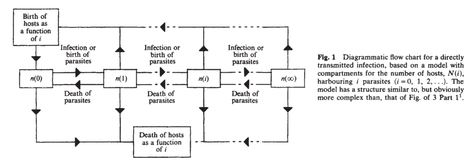

**Learning Goals**

1. Understand why host-macroparasite models need to be treated differently than host-microparasite models
2. Be able to write down a representation for an infinite series of ODEs and reduce it to two dimensions
4. Use R to explore the dynamics of the 2-dimensional host-parasite system

---

The packages you will need for this lessons are

1. `rootSolve`
2. `numDeriv`
3. `deSolve`
4. `ggplot2`

```{r, message=FALSE}
library(deSolve)
library(ggplot2)
library(rootSolve)
library(numDeriv)
```

## Macroparasites vs microparasites

In Anderson and May's (1978) canonical work on infectious disease, they made a key distinction between **microparasites** and **macroparasites**.  They defined microparasites as

"**Microparasites** (viruses, bacteria, protozoans) are characterised by small size, short generation times, extremely high rates of direct reproduction within the host, and tendency to induce immunity to reinfection in those hosts that survive the initial onslaught"

and macroparasites as

"**Macroparasites** (parasitic helminths and arthropods) tend to have much longer generation times than microparasites, and direct multiplication within the host is either absent or occurs at a low rate."

One of the key things that they noted about macroparasite infections is that parasite-induced mortality or parasite-induced reduction in host fertility is often directly linked to the number of parasites that are infecting a host.  Because of this, we can no longer simply consider whether a host is infected or susceptible as we have done in previous lessons.  Rather, we need to explicitly model the **distribution** of parasites across hosts.  

## An infinite series of ODEs for host-macroparasite systems

Modeling macroparasites starts with the following framework



Now we explicitly track the total number of host with $i= 0, 1, 2, \dots, \infty$ parasites in the population. Moreover, we will assume that we are modeling a macroparasite that does directly reproduce within a host and instead produces free-living stages $L$ that enter the environment and subsequently reinfect the host. We will also assume that hosts only acquire parasites and lose parasites one at a time (see Isham 1995, *The Annals of Applied Probability* who considers clumped parasite infections). Given these assumptions, the infinite system of ordinary differential equations is given by

$$\begin{align}
\frac{dp_0}{dt} &= -(d + \beta L)p_0 + \sigma p_{1} + b \sum_{i=0}^{\infty} p_i \\
\frac{dp_i}{dt} &= -(d + \beta L + i(\alpha + \sigma))p_i + \sigma (i + 1) p_{i + 1} + \beta L p_{i -1} \\
\frac{dL}{dt} &= \lambda \sum_{i = 0}^{\infty} i p_i - \delta L - \beta L \sum_{i = 0}^{\infty} p_i
\end{align}$$

where $p_i$ is the number of hosts with $i$ parasites, $L$ is the number of larvae in the environment, $\alpha$ is the per parasite rate of parasite-induced host mortality, $d$ is the intrinsic host death rate, $b$ is the intrinsic host birth rate, $\sigma$ is the parasite-death rate, $\beta L$ is the rate at which hosts acquire parasites (assuming $\beta$ contains both encounter and establishment), $\lambda$ is the rate of parasite reproduction, and $\delta$ is the death rate of larvae in the environment.

While there has been work that focuses on analyzing this infinite series of equations (e.g. Kretzschmar 1993, *Journal of Mathematical Analysis and Applications*), standard practice is to convert this infinite system of equations to a set of three equations given by

$$\begin{align}
\frac{dH}{dt} &= (b - d)H - \alpha P \\
\frac{dP}{dt} &= -(d + \sigma)P + \beta L H - \alpha H \sum_{i=0}^{\infty}i^2 r_i \\
\frac{dL}{dt} &= \lambda P - \delta L - \beta L H
\end{align}$$

## Deriving the reduced equations

To understand where these "reduced" equations come from, let's first consider $\frac{dH}{dt}$. To get this equation, sum the infinite series from $i = 0$ to $\infty$. Note that $\sum_{i=0}^{\infty} p_i = H$ and $\sum_{i=0}^{\infty} i * p_i = P$. Terms $\beta L H$ and $\sigma P$ cancel out (there are both positive and negative terms). For $H$ we get

$$\frac{d \sum_{i = 0}^\infty p_i}{dt} = -d \sum_{i = 0}^\infty  p_i - \alpha \sum_{i = 0}^\infty  i p_i + b * \sum_{i = 0}^\infty  p_i$$

which is 

$$\frac{d H}{dt} = (b - d) H - \alpha P$$

Again note that terms like $\beta L$ and $\sigma$ cancel out in the summation.

$\frac{d P}{dt}$ is just a bit trickier. The first equation $\frac{dp_0}{dt}$ doesn't matter because there are no parasites in those hosts. So we just need to multiply $\frac{dp_i}{dt}$ by $i$ and sum from $i=0$ to $\infty$.  Doing this we get

$$ \frac{d \sum_{i = 0}^\infty  i p_i}{dt} = -d \sum_{i = 0}^\infty i p_i - \alpha \sum_{i = 0}^\infty i^2 p_i + \sigma_{i = 0}^\infty (\sum_{i = 0}^\infty i (i + 1) p_{i + 1} - i^2 p_i) + \beta L(\sum_{i = 0}^\infty i p_{i -1} - i p_i)$$ 

this can be simplified to 

$$\frac{dP}{dt} = -d P - \alpha H \sum_{i = 0}^\infty i^2 \frac{p_i}{H} + \sigma (\sum_{i = 0}^\infty i (i + 1) p_{i + 1} - i^2 p_i) + \beta L(\sum_{i = 0}^\infty i p_{i -1} - i p_i)$$ 

The last two nasty-looking terms with $\sigma$ and $\beta L$ actually turn out to be quite simple when you take the sums. Convince your self by writing out each term sequentially and you will see the pattern emerges pretty quickly. You can then simplify to

$$ \frac{dP}{dt} = -d P - \sigma P + \beta L H - \alpha H \sum_{i = 0}^\infty i^2 \frac{p_i}{H}$$ 

Let $\frac{p_i}{H} = r_i$, which is the probability that a host has $i$ parasites.  $\sum_{i=0}^{\infty}i^2 r_i$ is the second moment of the host-parasite distribution and emerges because we assume that parasite-induced host mortality increases linearly with parasite load. The second moment of a random variable $X$ is defined as $E[X^2] = Var(X) + E[X]^2$.

Finally, we can assume that the dynamics of the free-living stage $L$ happen on a much faster time scale than the within host dynamics. Given this assumption, we can let $\frac{dL}{dt} = 0$ and get 

$$L = \frac{\lambda P}{\delta + \beta H}$$

and 

$$\beta L = \frac{\lambda P}{H_0 + H}$$

where $H_0 = \delta / \beta$. With this assumption we are left with two equations given by

$$\begin{align}
\frac{dH}{dt} &= (b - d)H - \alpha P \\
\frac{dP}{dt} &= -(d + \sigma)P + \frac{\lambda P H}{H_0 + H} - \alpha H \sum_{i=0}^{\infty}i^2 r_i 
\end{align}$$

These are the equations that Anderson and May explore in there classic 1978 paper *Regulation and Stability of Host-Parasite Population Interactions: I. Regulatory Processes*


Finally, sometimes you will see these equations expressed in terms of the mean parasite load $x = P / H$ (i.e. Kretzschmar and Adler 1994, *Theoretical Population Biology*).  You can make this conversion as follows

First note that $P = x H$.  Using the chain rule we see that

$$ \frac{dP}{dt} = \frac{dx}{dt}H + x \frac{dH}{dt} $$

Rearranging we get

$$\frac{dx}{dt} = (1 / H) (\frac{dP}{dt} - \frac{dH}{dt}x)$$

Then plugging in the two equations above we can get an equation for $\frac{dx}{dt}$. This gives us an equation in terms of the mean. We won't use this equation in the analysis below, but turns out that it can make the equations a bit more intuitive to analyze.

## The distributions of parasites across hosts

The two-dimensional set of equations in terms of $P$ and $H$  still have one term that needs to be dealt with: $\sum_{i=0}^{\infty}i^2 r_i$ which defines the second moment of the host-parasite distribution. In order to use these equations, one approach is to use **moment closure** whereby we write 
$\sum_{i=0}^{\infty}i^2 r_i$ in terms of a known distribution.

One easy (but not empirically supported!) option is to assume that parasites follow a Poisson distribution. The second moment of the Poisson distribution is given by $E[X] + E[X]^2$, which in terms of $P$ and $H$ is $\sum_{i=0}^{\infty}i^2 r_i = P / H + (P / H)^2$. 

> ### Exercise 1: Poisson-distributed parasites

> 1. Use `deSolve` to simulate the host-macroparasite model where the parasites follow a Poisson distribution. Let $\alpha =  0.5$, $\lambda = 6$, $H_0 = 10$, $\sigma = 0.1$, $b = 3$, and $d = 1$. Try different initial conditions for $H$ and $P$ and examine what happens.  Does this seem biologically realistic?

```{r}
# HIDE ME IF YOU DON'T WANT TO SEE THE ANSWER
library(deSolve)
library(ggplot2)

hp_poisson = function(times, init_vals, params){
  # ODEs for host-macroparasite model with Poisson distributed parasites
  H = init_vals[1]
  P = init_vals[2]
  
  alpha = params['alpha']
  lambda = params['lambda']
  H0 = params['H0']
  sigma = params['sigma']
  b = params['b']
  d = params['d']
  
  dHdt = (b - d)*H - alpha*P
  dPdt = -1*(d + sigma)*P + (lambda*P*H)/(H0 + H) - alpha*H*(P/H + (P/H)^2)
  
  return(list(c(dHdt, dPdt)))
}

init_vals = c(H=15, P=66)
params = c(alpha=0.5, lambda=6, H0=10, sigma=0.1, b=3, d=1)
times = seq(0, 15, len=100)
hp_sim = as.data.frame(ode(y=init_vals, times=times, func=hp_poisson, parms=params))

ggplot(data=hp_sim, aes(x=time, y=H, color="H")) + geom_line() + geom_line(aes(x=time, y=P, color="P"))
```

> 2. Perform a numerical equilibrium and stability analysis in R to better understand the properties of this dynamical system with the parameters given above.

```{r}
# HIDE ME IF YOU DON'T WANT TO SEE THE ANSWER

# Equilibrium analysis
library(rootSolve)

RHS_hp_poisson <- function(x, parms) {
	with(as.list(c(x, parms)),{
      c(F1 = (b - d)*H - alpha*P,
        F2 = -1*(d + sigma)*P + (lambda*P*H)/(H0 + H) - alpha*H*(P/H + (P/H)^2))
  }) # end with(as.list ...
}

#specify the values of the parameters
params = c(alpha=0.5, lambda=6, H0=10, sigma=0.1, b=3, d=1)

#specify the starting guesses for the state variables
x = c(H=5, P=5)

#call multiroot
eqm<-multiroot(RHS_hp_poisson, x, parms = params)

#the equilibrium values are stored in the root part of eqm
eqm$root
```

> 3. There is an equilibrium, but it seems like any pertubration from that equilibrium leads to cycles which vary with the size of the perturbation. Sounds a bit like **neutral stability**.  Check this with a stability analysis.

```{r}
# HIDE ME IF YOU DON'T WANT TO SEE THE ANSWER

# Package for numerically computing the jacobian
library(numDeriv)


hp_poisson_jac = function(x, params){
  # Function for numerically computing jacobian
  H = x[1]
  P = x[2]
  
  alpha = params['alpha']
  lambda = params['lambda']
  H0 = params['H0']
  sigma = params['sigma']
  b = params['b']
  d = params['d']
  
  dHdt = (b - d)*H - alpha*P
  dPdt = -1*(d + sigma)*P + (lambda*P*H)/(H0 + H) - alpha*H*(P/H + (P/H)^2)
  
  return(c(dHdt, dPdt))
}

# Compute the jacobian
jac = jacobian(hp_poisson_jac, c(15, 60), params=params)

# Examine the eigenvalues
eigen(jac)$values

```

> The real part of each eigenvalue is 0, indicating that this equilibrium is **neutrally stable** -- perturbations from the equilibrium will not return to the equilibrium, but will fluctuate around the equilibrium with an amplitude proportional to the initial perturbation. This is consistent with what we saw in our simulations above.


### Allowing for aggregated host-parasite distributions

Turns out that parasites are almost never distributed according to a Poisson distribution across hosts. They tend to be much more aggregated than a Poisson distribution (i.e.right skewed with variance > mean).  To capture this, another more realistic option is to assumption that the distribution of parasites across hosts follows a **negative binomial distribution**.  The negative binomial distribution has two parameters: $\mu$ and $k$. $\mu$ is the mean parasites per host and $k$ is an inverse measure of aggregation between 0 and $\infty$.  When $k \rightarrow \infty$ the negative binomial distribution approaches a Poisson.  Here is a plot of a few different NBD distributions compared to a Poisson.

```{r}
vals = seq(0, 20)
# the `size` argument is equivalent to k
plot(vals, dnbinom(vals, mu=5, size=0.3), type="l", ylab="Probability", xlab="Parasites per host")
lines(vals, dnbinom(vals, mu=5, size=1), type="l", col="blue")
lines(vals, dnbinom(vals, mu=5, size=100), type="l", col="red")
lines(vals, dpois(vals, 5), col="orange")
legend("topright", c("k = 0.3", "k = 1", "k = 100", "Poisson"), fill=c("black", "blue", "red", "orange"))
```

The second moment to the negative binomial distribution is given by $\frac{P}{H} + \frac{P^2}{H^2}\frac{k + 1}{k}$.  We could then write our host-macroparasite model as

$$\begin{align}
\frac{dH}{dt} &= (b - d)H - \alpha P \\
\frac{dP}{dt} &= -(d + \sigma)P + \frac{\lambda P H}{H_0 + H} - \alpha H (\frac{P}{H} + \frac{P^2}{H^2}\frac{k + 1}{k})
\end{align}$$


> ### Exercise 2: Explore this host-macroparasite NBD model in R.

> 1. Using the same parameters you used in exercise 1 with $k = 1$, what happens to the dynamics of the system?
> 2. Now increase and decrease parasite aggregation by changing $k$ (remember that increasing $k$ leads to decreasing aggregation).  What happens to the dynamics?

```{r}
# HIDE ME IF YOU DON'T WANT TO SEE THE ANSWER
hp_nbd = function(times, init_vals, params){
  # ODEs for host-macroparasite model with NBD distributed parasites
  H = init_vals[1]
  P = init_vals[2]
  
  alpha = params['alpha']
  lambda = params['lambda']
  H0 = params['H0']
  sigma = params['sigma']
  b = params['b']
  d = params['d']
  k = params['k']
  
  dHdt = (b - d)*H - alpha*P
  dPdt = -1*(d + sigma)*P + (lambda*P*H)/(H0 + H) - alpha*H*(P/H + (P/H)^2 * (k + 1) / k)
  
  return(list(c(dHdt, dPdt)))
}

init_vals = c(H=15, P=66)
params = c(alpha=0.5, lambda=6, H0=10, sigma=0.1, b=3, d=1, k=1)
times = seq(0, 15, len=100)
hp_sim = as.data.frame(ode(y=init_vals, times=times, func=hp_nbd, parms=params))

ggplot(data=hp_sim, aes(x=time, y=H, color="H")) + geom_line() + 
  geom_line(aes(x=time, y=P, color="P")) + ylab("Host/Parasite abundance")

```

Including parasite aggregation seems to have stabilized the neutrally stable system without parasite aggregation. This is one of the reasons that aggregation is considered a **stabilizing mechanism** population dynamics. However, note that in this model, if aggregation is too high ($k$ is small) the parasite can't regulate host abundance and the host grows exponentially. Thus while aggregation increases the stability of the system, it decreases the parameter space in which an finite host-macroparasite equilibrium can exist. 

This is clearly illustrated by analytically solving for the host equilibrium.  You can show that a non-zero host equilibrium only exists when $\lambda > b + \sigma + \alpha + \frac{(b - d)}{k}$ (Anderson and May, 1978).

This leads us into our final exercise of understanding the role of parasite reproductive rate $\lambda$ on the dynamics of the host-macroparasite system.

> ### Exercise 3: The role of parasite reproduction in host-macroparasite dynamics
>
> $R_0$ for macroparasites is defined a bit differently than for microparasites. In particular, **$R_0$ is defined as the average number of reprodutively mature daughter parasites than would be produced by the average female parasite in her lifetime.** For the simple host-macroparasite model defined above (with Poisson or NBD aggregation)
>
$$R_0 = \frac{\lambda}{d + \sigma + \alpha}$$
>
> where you can see that $R_0$ is a product of the average lifetime of an female parasite $\frac{1}{d + \sigma + \alpha}$ and the reproductive rate $\lambda$.  
>
> Simulate your host-macroparasite model with NBD aggregation, $\lambda < d + \sigma + \alpha$ ($R_0 < 1$), and some initial parasite population. What happens to the parasite?

```{r}
# HIDE ME IF YOU DON'T WANT TO SEE THE ANSWER
init_vals = c(H=15, P=66)
params = c(alpha=3, lambda=3, H0=10, sigma=0.1, b=3, d=1, k=1)

hp_sim = as.data.frame(ode(y=init_vals, parms=params, func=hp_nbd, times=times))

ggplot(data=hp_sim, aes(x=time, y=H, color="H")) + geom_line() + 
  geom_line(aes(x=time, y=P, color="P")) + ylab("Host/Parasite abundance") + ylim(c(0, 100))


```
> Just like for a microparasite system, when $R_0 < 1$ the parasite cannot invade!
>
> Next, consider the case where a parasite can invade $\lambda > d + \sigma + \alpha$ ($R_0 > 1$), but the net host growth rate $b - d$ is larger than the net reproductive rate of the parasite $\lambda - \sigma - \alpha - d$. Explore the population dynamics in this case. What do you notice?

```{r}
# HIDE ME IF YOU DON'T WANT TO SEE THE ANSWER
init_vals = c(H=15, P=66)
params = c(alpha=3, lambda=6, H0=10, sigma=0.1, b=3.5, d=1, k=1)

hp_sim = as.data.frame(ode(y=init_vals, parms=params, func=hp_nbd, times=times))

ggplot(data=hp_sim, aes(x=time, y=log(H), color="H")) + geom_line() + 
  geom_line(aes(x=time, y=log(P), color="P")) + ylab("log host/parasite abundance") + ylim(c(0, 100))

```

> Notice that now the parasite can invade and both hosts and parasites grow exponentially However, hosts do so at a faster rate than the parasite, such that the mean parasite load goes to 0.
>
> Next, consider the case where the net rate of parasite increase $\lambda - \sigma - \alpha - d$ is greater than 0 and greater than the hosts net rate of increase $0 < b - d < \lambda - \sigma - \alpha - d$, but is less than $b - d + \frac{b - d}{k}$. This next term reflects the fact that when parasites are aggregated, the effect of the parasite is not equally distributed across the whole host population because many hosts are uninfected.  What happens to the dynamics of the system?

```{r}
# HIDE ME IF YOU DON'T WANT TO SEE THE ANSWER
init_vals = c(H=15, P=66)
params = c(alpha=3, lambda=8, H0=10, sigma=0.1, b=3.5, d=1, k=1)

hp_sim = as.data.frame(ode(y=init_vals, parms=params, func=hp_nbd, times=times))

ggplot(data=hp_sim, aes(x=time, y=log(H), color="H")) + geom_line() + 
  geom_line(aes(x=time, y=log(P), color="P")) + ylab("log host/parasite abundance") + ylim(c(0, 100))

```

> We see that after an initial transient period, both hosts and parasites increase exponentially, but at the same rate. This leads to a finite mean parasite purden in the host population. 
>
> Finally, when net rate of increase of the parasite is greater than $b - d + \frac{b - d}{k}$ ($\lambda - \sigma - \alpha - d > b - d + \frac{b - d}{k}$) a finite equilibrium exists and the parasite can regulate the host population. 

```{r}

init_vals = c(H=15, P=66)
params = c(alpha=3, lambda=10, H0=10, sigma=0.1, b=3.5, d=1, k=1)

hp_sim = as.data.frame(ode(y=init_vals, parms=params, func=hp_nbd, times=times))

ggplot(data=hp_sim, aes(x=time, y=H, color="H")) + geom_line() + 
  geom_line(aes(x=time, y=P, color="P")) + ylab("Host/parasite abundance")
```
